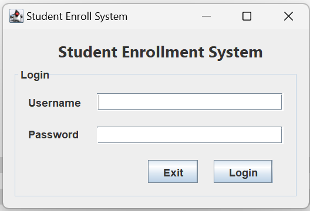
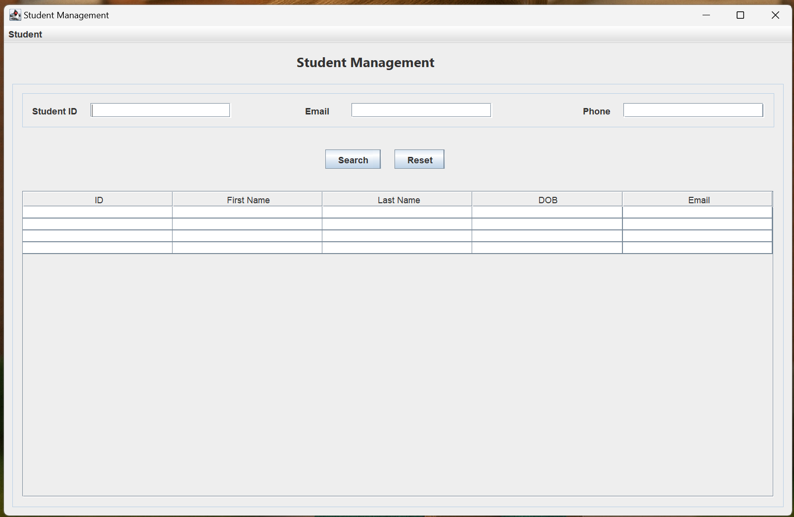
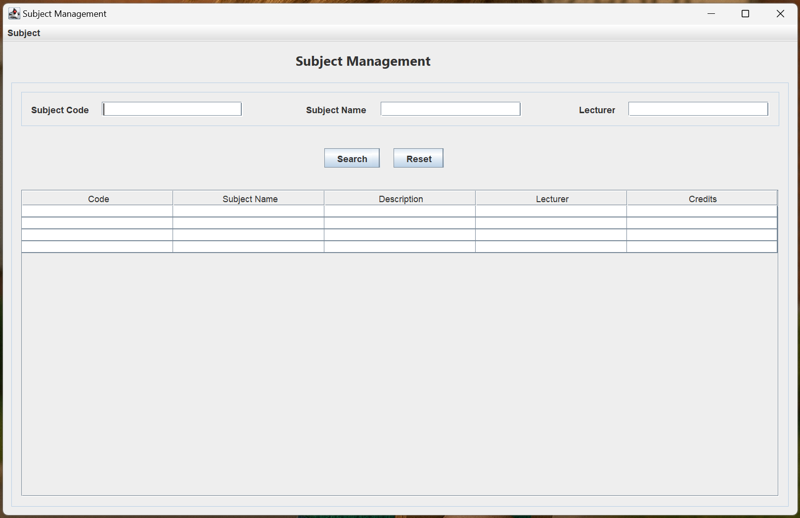
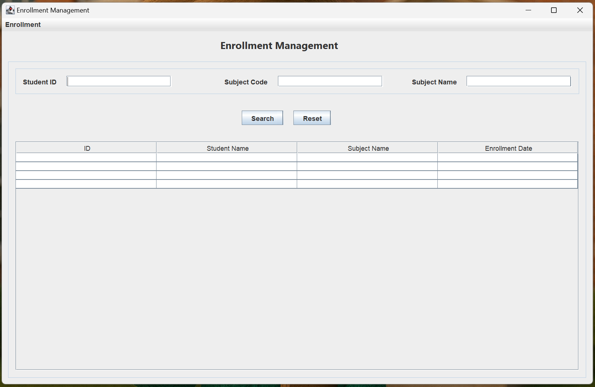

A **step‑by‑step Java Swing + MySQL project** that connects the fundamentals we’ve covered on our "LankaDroid Programming Kuppiya" YouTube channel (Java basics, OOP, ER diagrams, relational schema, MySQL, and GUI design) into a *working* student‑enrollment system.

---

## 📸 GUI Preview

| Login Dialog | Main Window | Student Management | Subject Management | Enrollment Management |
|--------------|-------------|--------------------|--------------------|-----------------------|
|  |  |  |  |  |

---


## Learning Goals

* Design a small‑scale CRUD application from scratch  
* Wire a Swing front‑end to a MySQL back‑end  
* Apply clean OOP principles and basic design patterns  
* Use Git branches to follow progressive checkpoints

---

## Roadmap

1. **GUI Skeleton** – build the screens in NetBeans  
2. **Database Schema** – MySQL tables & sample data  
3. **Student CRUD** – add / edit / delete students  
4. **Course CRUD** – manage course catalogue  
5. **Enrollment Flow** – register students for courses  
6. **Tests & Refactor** – JUnit 5 and code cleanup  

*(Each step will be a separate YouTube video **and** a dedicated Git branch.)*

---

## 📁 Git Branch Strategy

This project uses a **branch-per-video** approach to clearly illustrate each stage of development:

* `main`: Contains the complete and finalized system.
* `video-xx-feature-name`: Represents the state of the project at the end of each corresponding video.

**Example:**

* `video-01-gui-skeleton`
* `video-02-database-schema`
* `video-03-student-crud`

### How to use branches:

Clone and checkout a specific video branch:

```bash
git clone https://github.com/nuwanAsiri/student-enroll-system.git
cd student-enroll-system
git checkout video-01-gui-skeleton
```

You can then explore and compare changes between branches directly on GitHub.

---

## 🛠 GitHub Collaboration

### Issues

Use [GitHub Issues](https://github.com/nuwanAsiri/student-enroll-system/issues) to:

* Ask questions or clarify doubts related to specific videos or concepts
* Report bugs and request enhancements
* Discuss and collaborate openly with peers

### Pull Requests (PRs)

Submit your improvements via [Pull Requests](https://github.com/nuwanAsiri/student-enroll-system/pulls):

* Fork the repository
* Create your feature branch (`git checkout -b feature/my-idea`)
* Commit your changes
* Push your branch and open a PR for review

### Discussions

Use [GitHub Discussions](https://github.com/nuwanAsiri/student-enroll-system/discussions) to:

* Engage in broader topic discussions and Q\&A sessions
* Share insights, challenges, and best practices with the community
* Get feedback on ideas or conceptual understanding

---


## Tech Stack

* Java 17  (works with 11+)  
* Swing (NetBeans GUI Builder)  
* MySQL 8  
* JUnit 5 (unit tests, later stage)

---

**Prerequisites**
* JDK 17+
* MySQL 8+
* NetBeans 17 or IntelliJ/Eclipse if you prefer

## Getting Started

```bash
# clone the repo
git clone https://github.com/nuwanAsiri/student-enroll-system.git
cd student-enroll-system

# import into NetBeans (File ▸ Open Project)
# create a local MySQL schema called 'lankadroid_student_enroll' TBU
# hit Run (F6) – the main screen should load
```
## 🤝 Contributing

1. Fork the repository
2. Create your feature branch: git checkout -b feature/my-idea
3. Commit your changes
4. Push and open a Pull Request

## 📜 License
MIT – do anything, just give credit.
